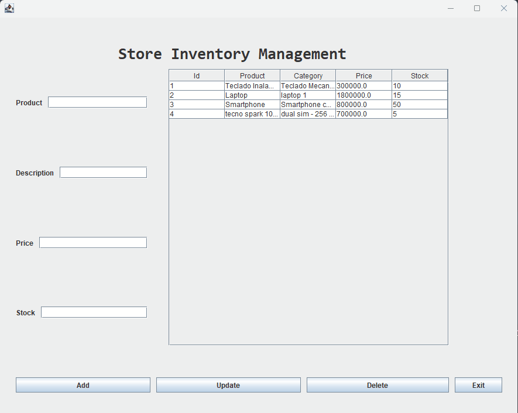

# Store Inventory Management System

This project is a desktop application for managing store inventory using Java. It leverages JavaFX, Swing for the GUI, Spring Boot for the backend, and MySQL for the database.

## Features

- Add, update, and delete products.
- List all products in the inventory.
- Load selected product details into the form for editing.
- Disable the "Add" button when a product is selected for updating, and enable it again after the update.
- Exit the application using an "Exit" button.

## Technologies Used

- **Java**
- **JavaFX**
- **Swing**
- **Spring Boot**
- **MySQL**

## Prerequisites

Before you begin, ensure you have the following installed:

- [Java JDK 8 or later](https://www.oracle.com/java/technologies/javase-downloads.html)
- [Spring Boot](https://spring.io/projects/spring-boot)
- [MySQL](https://www.mysql.com/)
- [Maven](https://maven.apache.org/)

## Setup Instructions

1. **Clone the Repository**
    ```sh
    git clone https://github.com/AlexisMartinez1913/store-inventory-management.git
    cd store-inventory-management
    ```

2. **Configure the Database**
    - Create a MySQL database named `store_inventory`.
    - Update the `application.properties` file with your MySQL username and password.
      ```properties
      spring.datasource.url=jdbc:mysql://localhost:3306/store_inventory
      spring.datasource.username=your_username
      spring.datasource.password=your_password
      spring.jpa.hibernate.ddl-auto=update
      ```

3. **Build and Run the Application**
    ```sh
    mvn clean install
    mvn spring-boot:run
    ```

4. **Run the Application**
    - The application can be run from your IDE (e.g., IntelliJ IDEA, Eclipse) by running the `ProductForm` class.

## Application Structure

- `entity` - Contains the `Product` entity.
- `repository` - Contains the `ProductRepository` interface for CRUD operations.
- `service` - Contains the `ProductService` interface and its implementation `ProductServiceImpl`.
- `view` - Contains the `ProductForm` class for the GUI.

## Usage

1. **Add Product**
    - Fill in the product details (name, description, price, stock) and click "Add".

2. **Update Product**
    - Select a product from the table to load its details into the form.
    - Edit the details as needed and click "Update".

3. **Delete Product**
    - Select a product from the table and click "Delete".

4. **Exit Application**
    - Click the "Exit" button to close the application.

## Screenshots



## Contributing

Contributions are welcome! Please open an issue or submit a pull request.

## License

This project is licensed under the MIT License. See the [LICENSE](LICENSE) file for details.

## Contact

For any inquiries, please contact [jhonyalexis100@gmail.com](mailto:your-email@example.com).
